# Netology_devops_net-2

1. Проверьте список доступных сетевых интерфейсов на вашем компьютере. Какие команды есть для этого в Linux и в Windows?
В Windows:
   Интерфейсы:
   ```
   C:\Users\MedvedevAE>ipconfig /all
   ```
   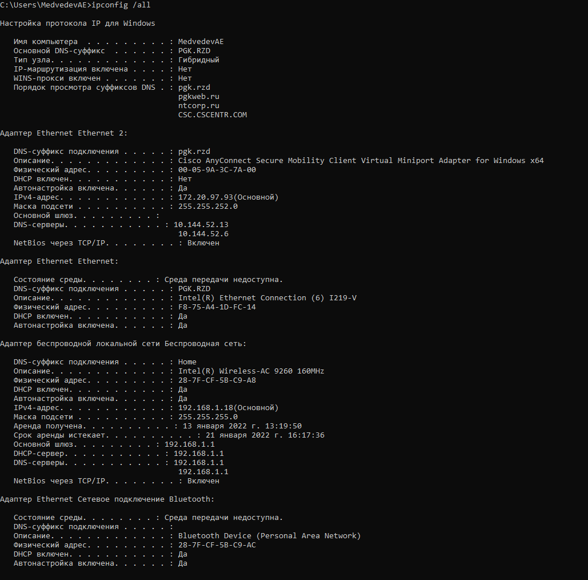
Состояние интерфейсов:
    ```
    C:\Users\MedvedevAE>netsh interface show interface
    ```
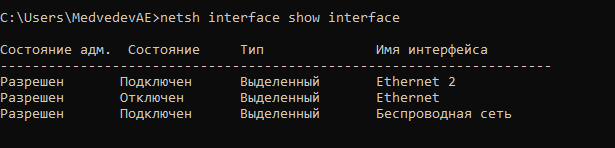

В Linux:
```
vagrant@vagrant:~$ sudo apt install net-tools
vagrant@vagrant:~$ ifconfig
```
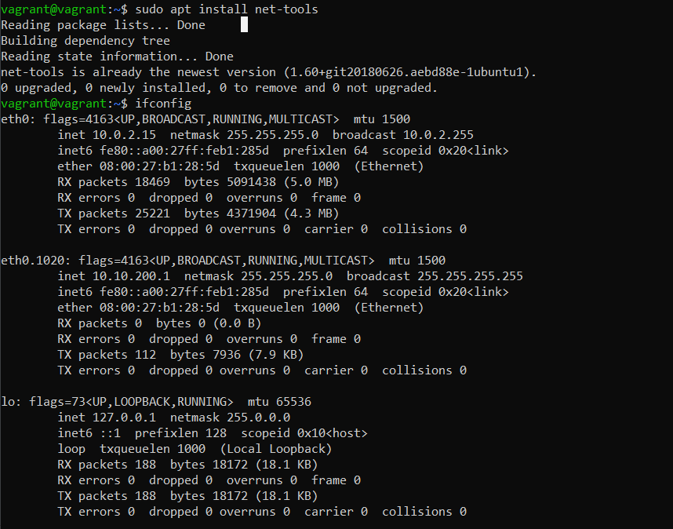
2. Какой протокол используется для распознавания соседа по сетевому интерфейсу? Какой пакет и команды есть в Linux для этого?

```
vagrant@vagrant:~$ sudo apt install lldpd
vagrant@vagrant:~$ lldpctl
```
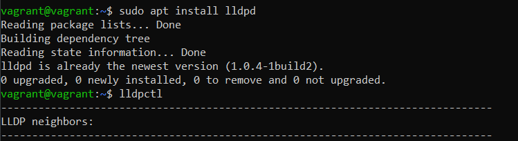

3. Какая технология используется для разделения L2 коммутатора на несколько виртуальных сетей? Какой пакет и команды есть в Linux для этого? Приведите пример конфига.

VLAN позволяет виртуально разделить коммутатор на несколько сетей. Устанавливается ветка VLAN ID.
```
at@srv01:~$ sudo apt install vlan
```
добавляем 8021g
```
vagrant@vagrant:~$ sudo modprobe 8021q
vagrant@vagrant:~$ lsmod | grep 8021q
```
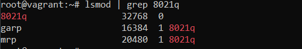

переходим в рут
```
root@vagrant:~# echo 8021q >> /etc/modules
```
Добавляем две vlan подсети
```
root@vagrant:~# ip link add link eth0 name eth0.1010 type vlan id 1010
root@vagrant:~# ip link add link eth0 name eth0.1020 type vlan id 1020
```
Смотрим интерфейсы:
```
root@vagrant:~# ip addr show
```
``` 
1: lo: <LOOPBACK,UP,LOWER_UP> mtu 65536 qdisc noqueue state UNKNOWN group default qlen 1000
    link/loopback 00:00:00:00:00:00 brd 00:00:00:00:00:00
    inet 127.0.0.1/8 scope host lo
       valid_lft forever preferred_lft forever
    inet6 ::1/128 scope host 
       valid_lft forever preferred_lft forever
2: eth0: <BROADCAST,MULTICAST,UP,LOWER_UP> mtu 1500 qdisc fq_codel state UP group default qlen 1000
    link/ether 08:00:27:b1:28:5d brd ff:ff:ff:ff:ff:ff
    inet 10.0.2.15/24 brd 10.0.2.255 scope global dynamic eth0
       valid_lft 86061sec preferred_lft 86061sec
    inet6 fe80::a00:27ff:feb1:285d/64 scope link 
       valid_lft forever preferred_lft forever
3: eth0.1010@eth0: <BROADCAST,MULTICAST> mtu 1500 qdisc noop state DOWN group default qlen 1000
    link/ether 08:00:27:b1:28:5d brd ff:ff:ff:ff:ff:ff
4: eth0.1020@eth0: <BROADCAST,MULTICAST> mtu 1500 qdisc noop state DOWN group default qlen 1000
    link/ether 08:00:27:b1:28:5d brd ff:ff:ff:ff:ff:ff

```
Запускаем интерфейс:
```
root@vagrant:~# ip link set dev eth0.1010 up
```
Задаем подсеть и маску подсети
```
root@vagrant:~# ip addr add 10.10.100.1/24 brd 255.255.255.255 dev eth0.1010
```
смотрим результат
```
root@vagrant:~# ip addr show
```
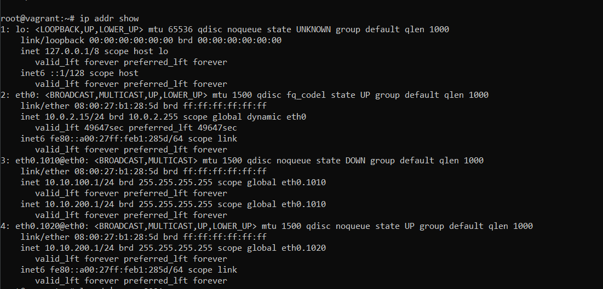

Конфиг файл:
```
root@vagrant:~# cat /etc/network/intefaces
```
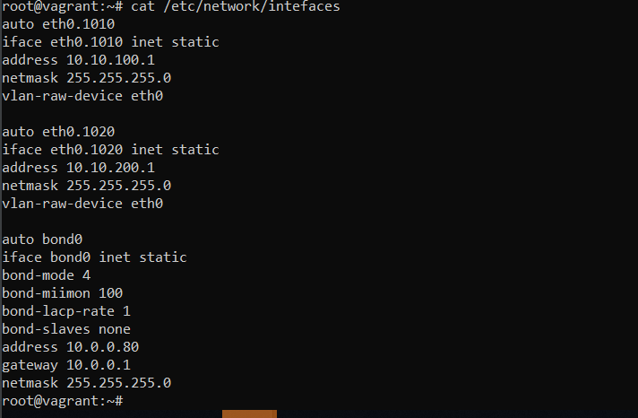

4. Какие типы агрегации интерфейсов есть в Linux? Какие опции есть для балансировки нагрузки? Приведите пример конфига.

Bonding – это объединение сетевых интерфейсов по определенному типу агрегации, Служит для увеличения пропускной способности и/или отказоустойчивость сети.

Типы агрегации интерфейсов в Linux:

Mode-0(balance-rr) – Данный режим используется по умолчанию. Balance-rr обеспечивается балансировку нагрузки и отказоустойчивость. В данном режиме сетевые пакеты отправляются “по кругу”, от первого интерфейса к последнему. Если выходят из строя интерфейсы, пакеты отправляются на остальные оставшиеся. Дополнительной настройки коммутатора не требуется при нахождении портов в одном коммутаторе. При разностных коммутаторах требуется дополнительная настройка.

Mode-1(active-backup) – Один из интерфейсов работает в активном режиме, остальные в ожидающем. При обнаружении проблемы на активном интерфейсе производится переключение на ожидающий интерфейс. Не требуется поддержки от коммутатора.

Mode-2(balance-xor) – Передача пакетов распределяется по типу входящего и исходящего трафика по формуле ((MAC src) XOR (MAC dest)) % число интерфейсов. Режим дает балансировку нагрузки и отказоустойчивость. Не требуется дополнительной настройки коммутатора/коммутаторов.

Mode-3(broadcast) – Происходит передача во все объединенные интерфейсы, тем самым обеспечивая отказоустойчивость. Рекомендуется только для использования MULTICAST трафика.

Mode-4(802.3ad) – динамическое объединение одинаковых портов. В данном режиме можно значительно увеличить пропускную способность входящего так и исходящего трафика. Для данного режима необходима поддержка и настройка коммутатора/коммутаторов.

Mode-5(balance-tlb) – Адаптивная балансировки нагрузки трафика. Входящий трафик получается только активным интерфейсом, исходящий распределяется в зависимости от текущей загрузки канала каждого интерфейса. Не требуется специальной поддержки и настройки коммутатора/коммутаторов.

Mode-6(balance-alb) – Адаптивная балансировка нагрузки. Отличается более совершенным алгоритмом балансировки нагрузки чем Mode-5). Обеспечивается балансировку нагрузки как исходящего так и входящего трафика. Не требуется специальной поддержки и настройки коммутатора/коммутаторов.


Агрегация интерфейсов в Linux, в случае бондинга:
```
root@vagrant:~# sudo  apt install ifenslave
root@vagrant:~# vim /etc/modprobe.d/bonding.conf
bonding mode=4 miimon=100 lacp_rate=1

root@vagrant:~# cat /etc/network/interfaces
```
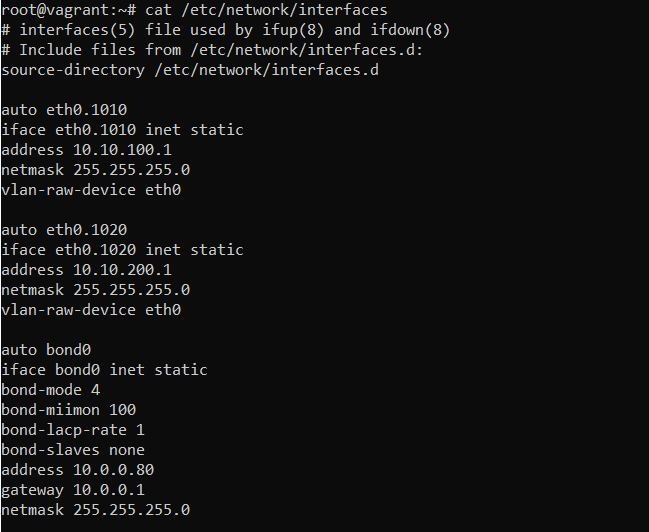

5. Сколько IP адресов в сети с маской /29 ? Сколько /29 подсетей можно получить из сети с маской /24. Приведите несколько примеров /29 подсетей внутри сети 10.10.10.0/24.

С маской /29 - 8 адресов. С маской /24 - 256 адресов. Подсетей 256/8 = 32 подсети.
Примеры подсетей 29:
```
root@vagrant:/etc/network# ipcalc 10.10.10.0/29
```
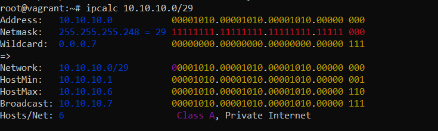

6. Задача: вас попросили организовать стык между 2-мя организациями. Диапазоны 10.0.0.0/8, 172.16.0.0/12, 192.168.0.0/16 уже заняты. Из какой подсети допустимо взять частные IP адреса? Маску выберите из расчета максимум 40-50 хостов внутри подсети.

Можно взять адреса из дополнительного диапазона для межорганизационного взаимодействия с маской к примеру /26, в которую может войти максимум 62 хоста:
``` 
root@vagrant:/etc/network# ipcalc 100.64.0.0/26
```
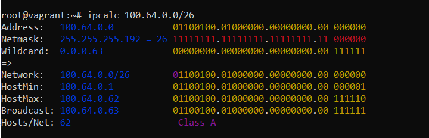

7. Как проверить ARP таблицу в Linux, Windows? Как очистить ARP кеш полностью? Как из ARP таблицы удалить только один нужный IP?
В Linux:
   ```
   vagrant@vagrant:~$ arp -a
   root@vagrant:/etc/network# ip neigh
   ```
   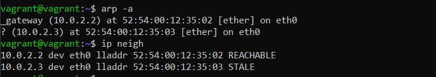
Сбрасываем кэш:
   ```
   vagrant@vagrant:~$ sudo -i
   root@vagrant:~# ip neigh
   ```
   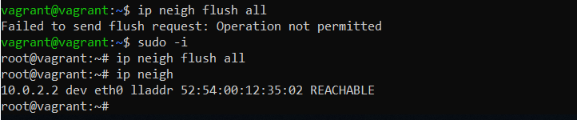

В Windows также:
```
C:\Users\MedvedevAE>arp -a
```
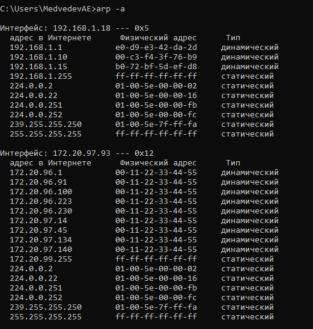